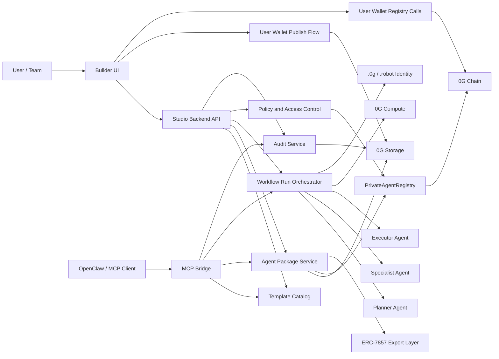
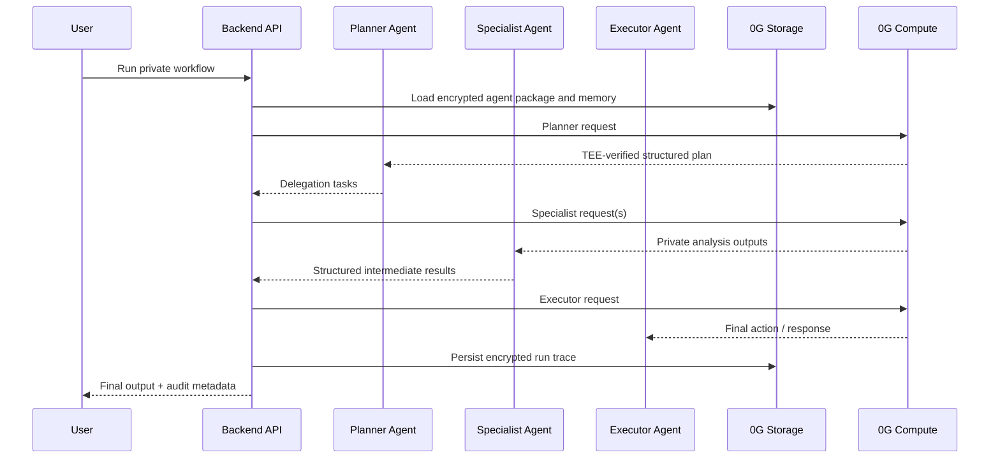
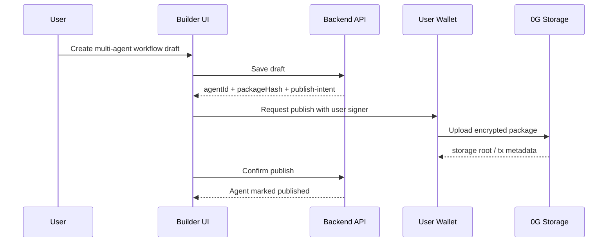
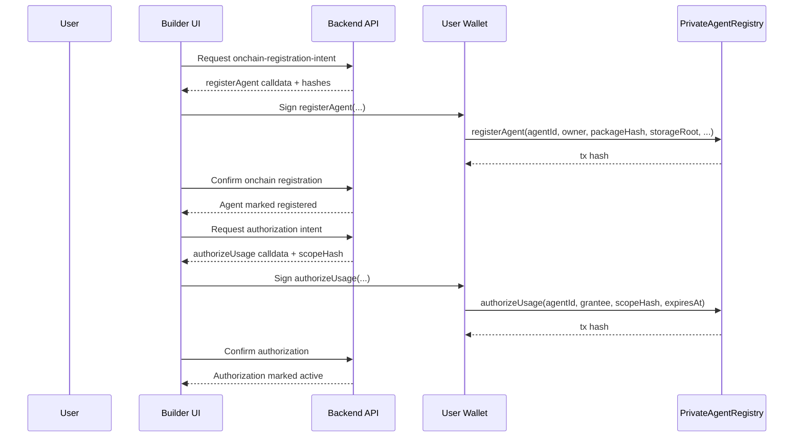

# Private Agent Studio Architecture

Private Agent Studio is a privacy-first, no-code system for building and running multi-agent workflows on 0G.

It targets three hackathon tracks at once:

- `Track 1`: multi-agent orchestration and workflow runtime
- `Track 5`: private memory, private prompts, and TEE-backed execution
- `Track 3`: exportable, ownable, and licensable agent assets

## Product Thesis

Users should be able to:

- build agents visually without code
- keep prompts, memory, and knowledge private
- run multi-agent workflows with role delegation
- publish agent packages with their own wallet
- export or authorize those agents for other users and teams
- retain onchain proof of ownership, permissions, and usage

## System Diagram

## A2A Workflow

## Draft And Publish Flow

## Onchain Registration And Authorization

## Privacy Model

Private by default:

- prompts
- uploaded knowledge
- long-term memory
- intermediate A2A messages
- run traces
- secret tool credentials

Public or onchain:

- agent ownership
- export / authorization rights
- policy hashes
- pricing / licensing references
- final execution commitments or receipts

This is the honest split: reasoning can be private, while ownership and settlement can still be verifiable.

## 0G Mapping

- `0G Storage`
  - browser wallet publication path for user-owned packages
  - encrypted agent packages
  - uploaded knowledge
  - long-context memory
  - run traces
  - audit events
- `0G Compute`
  - planner role execution
  - specialist role execution
  - executor role execution
  - TEE verification through response processing
  - optional direct API access for hosted runtime mode
- `0G Chain`
  - `PrivateAgentRegistry` for published-agent ownership
  - package hash and storage root anchoring
  - policy and workflow hash anchoring
  - usage authorization state for API and MCP runtimes
- `ERC-7857`
  - exportable agent assets
  - encrypted metadata
  - clone / authorize / transfer path
- `.0g` and `.robot`
  - user and agent identity
  - future A2A addressing and agent commerce

## Core Backend Modules

- `Template Catalog`
  - curated starting points for private research, treasury ops, and DAO ops
- `Agent Package Service`
  - creates local draft packages, privacy policies, role manifests, publish intents, and registration intents
- `Workflow Run Orchestrator`
  - runs planner, specialist, and executor roles in sequence
- `Policy and Access Control`
  - controls exportability, approvals, collaborator rights, and onchain usage grants
- `Audit Service`
  - records immutable run and lifecycle metadata
- `PrivateAgentRegistry`
  - minimal onchain registry for published agent ownership and usage rights
- `MCP Bridge`
  - exposes studio tools to OpenClaw and other MCP-compatible runtimes
  - keeps agent invocation on the same backend control plane as the HTTP API
  - export manifests now include an OpenClaw-compatible stdio server definition using `command`, `args`, `env`, and `cwd`

## Core Entities

- `Template`
  - prebuilt multi-agent workflow design
- `Agent Package`
  - reusable, private workflow definition owned by a wallet
- `Agent Role`
  - planner, specialist, executor, or other scoped worker
- `Workflow Run`
  - one execution instance of an agent package
- `Audit Event`
  - lifecycle event persisted for review

## Current Build Phases

1. docs and product narrative aligned to Tracks 1, 5, and 3
2. backend foundation for templates, private agent packages, and A2A run orchestration
3. stronger validation and policy enforcement
4. chain registration and authorization layer
5. frontend builder and demo polish
