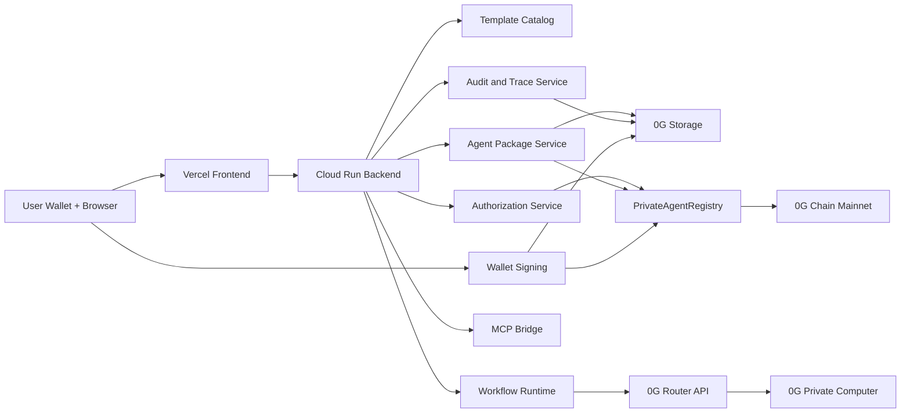
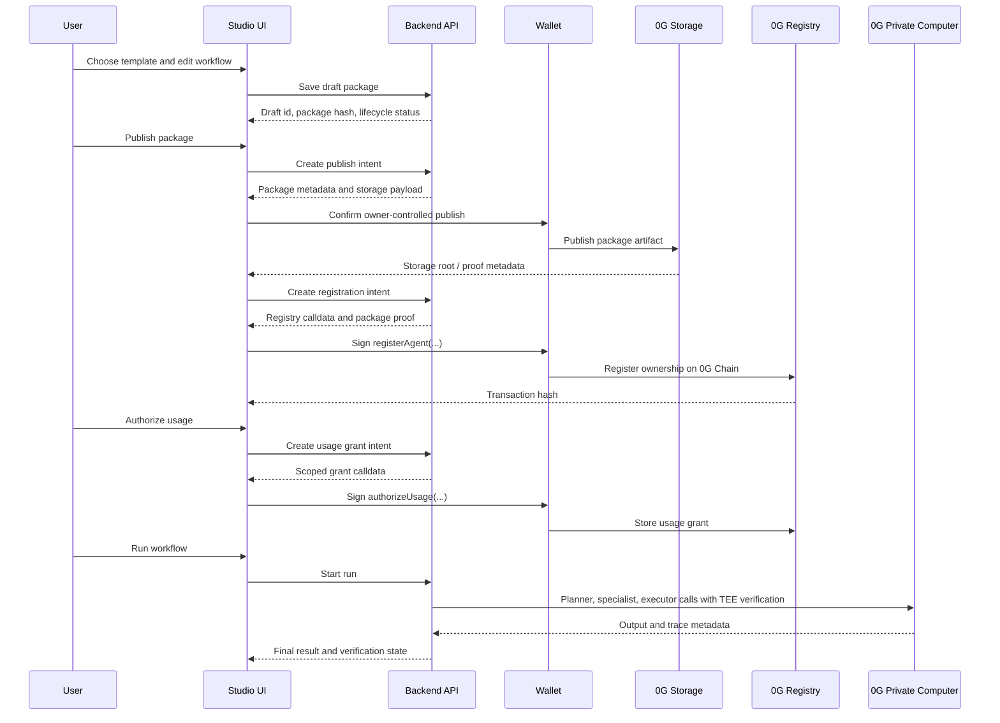
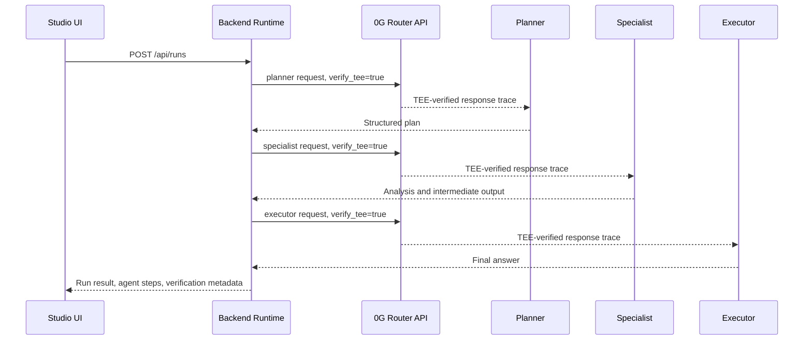

# Private Agent Studio Architecture

Private Agent Studio is a product layer for creating, owning, authorizing, and running private AI agent workflows on 0G.

The architecture is intentionally split into five lifecycle stages:

1. Build a private workflow.
2. Publish the package.
3. Register ownership onchain.
4. Authorize scoped usage.
5. Run TEE-verified inference.

This split keeps the product usable for non-technical users while still giving judges clear proof of where 0G is used.

## Production Topology

## Deployed Artifacts

| Layer | Deployment |
| --- | --- |
| Frontend | https://private-agent-studio.vercel.app |
| Studio route | https://private-agent-studio.vercel.app/studio |
| Backend | https://private-agent-studio-backend-1064261519338.europe-west1.run.app |
| 0G Chain | Mainnet, `chainId=16661` |
| Registry contract | `0xd06ea0b9AD8935df0e823555F0433604B880711D` |
| Registry explorer | https://chainscan.0g.ai/address/0xd06ea0b9AD8935df0e823555F0433604B880711D |
| Deploy tx | https://chainscan.0g.ai/tx/0xb0aefbd872d057f80c09c4d80b7e47ab96211b2c51f4c015d1d232d5c7464e62 |
| Compute API | `https://router-api.0g.ai/v1` |
| Compute model | `0GM-1.0-35B-A3B` |

## Product Lifecycle

## Runtime Execution

The runtime path is deliberately narrow. The backend owns orchestration, while 0G Private Computer owns inference.

The current production configuration requires TEE verification. If the 0G Router response does not provide the expected verification trace, the backend marks that state explicitly instead of presenting it as verified.

## Proof Boundaries

| Boundary | Private / Offchain | Public / Verifiable |
| --- | --- | --- |
| Build | Draft workflow, prompts, role instructions, editable package state | Package hash once prepared for publish |
| Publish | Full package contents and local editing state | Storage root and publish metadata |
| Register | Internal lifecycle bookkeeping | Owner, package hash, storage root, policy hash, contract event |
| Authorize | Product policy interpretation and UI state | Scoped grant hash, grantee, expiry, registry transaction |
| Run | Prompt content, intermediate reasoning, orchestration details | TEE verification metadata, run receipts, optional trace commitments |

This is the core product promise: private workflow contents can stay controlled while ownership and usage become externally provable.

## Backend Modules

- `Template Catalog`: curated starting points for private workflows.
- `Agent Package Service`: draft creation, package hashing, publish intents, and registration intents.
- `Authorization Service`: scoped usage grant and revocation flows.
- `Workflow Runtime`: planner, specialist, and executor orchestration.
- `0G Compute Adapter`: OpenAI-compatible 0G Router integration with TEE verification handling.
- `0G Chain Adapter`: registry configuration, chain metadata, and transaction intent support.
- `0G Storage Adapter`: package publish and storage proof integration path.
- `Audit and Trace Service`: lifecycle and runtime trace records.
- `MCP Bridge`: exposes the same control plane to external agent runtimes without creating a separate product path.

## Contract Role

`PrivateAgentRegistry` is the onchain ownership and permission anchor. It is intentionally small:

- register an agent package under the package owner's wallet
- store package hash and storage root references
- store workflow or policy hashes
- create and revoke usage grants
- expose read methods for product and judge verification

The contract is not responsible for private prompt execution. Execution stays in the backend and 0G Compute path.

## Security Model

- Production secrets stay outside git.
- The 0G Compute API key is stored in Google Secret Manager for Cloud Run.
- The frontend receives only the public backend URL.
- Wallet-controlled actions stay separated from backend-only lifecycle actions.
- Runtime verification is represented from the 0G response trace, not hardcoded UI state.
- Missing integration configuration should fail visibly instead of being hidden behind a mock success path.

## Current Persistence Boundary

The deployed Cloud Run service currently uses backend-managed local state for demo lifecycle records. That is sufficient for the hackathon proof path, but durable production state should move to a managed datastore before broader user onboarding.

The important deployed proof is already external:

- registry contract on 0G mainnet
- explorer-visible deployment transaction
- live Cloud Run backend
- live Vercel frontend
- live 0G Router compute execution with TEE verification metadata

## Next Production Hardening

- Move draft, package, grant, and run state into a durable database.
- Persist run trace commitments to 0G Storage after each production run.
- Add a user-facing wallet transaction review screen for every registry action.
- Add a judge-friendly proof panel with registry address, storage root, run id, and TEE verification state in one place.
- Add stricter role/package validation before publish.
