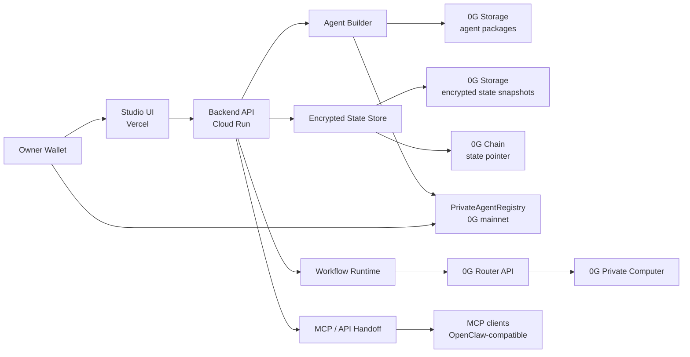
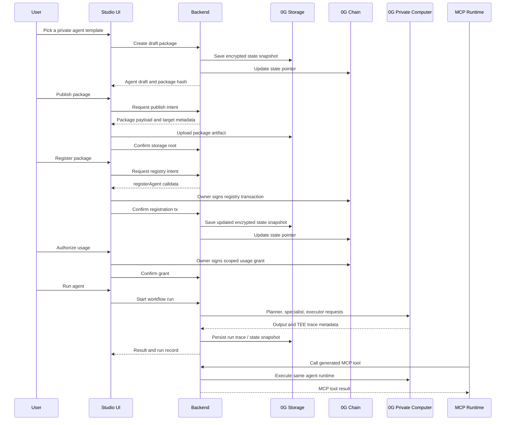
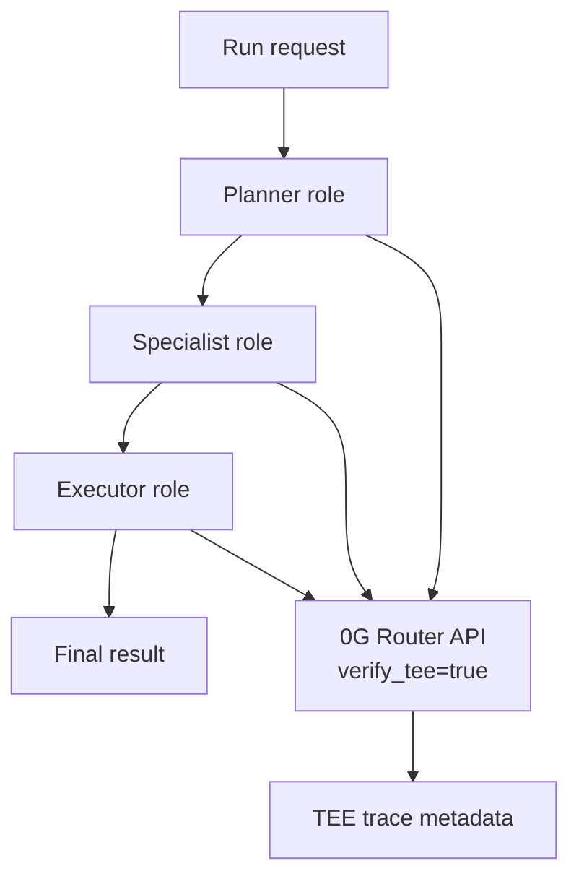

# Architecture

Private Agent Studio is a 0G-native control plane for private agent lifecycle management. The architecture separates the product workflow from the proof layer so a user can work in a simple Studio while every important lifecycle event remains inspectable.

## System View



## Deployed Surfaces

| Layer | Deployment |
| --- | --- |
| Frontend | https://private-agent-studio.vercel.app |
| Backend | https://private-agent-studio-backend-1064261519338.europe-west1.run.app |
| 0G network | Mainnet, `chainId=16661` |
| Registry contract | `0xd06ea0b9AD8935df0e823555F0433604B880711D` |
| Registry explorer | https://chainscan.0g.ai/address/0xd06ea0b9AD8935df0e823555F0433604B880711D |
| Deploy tx | https://chainscan.0g.ai/tx/0xb0aefbd872d057f80c09c4d80b7e47ab96211b2c51f4c015d1d232d5c7464e62 |
| Compute endpoint | `https://router-api.0g.ai/v1` |
| Compute model | `0GM-1.0-35B-A3B` |

## Lifecycle



## State Persistence

Production state is not tied to a Cloud Run container.

The backend writes encrypted snapshots of Studio state to 0G Storage. The latest snapshot root is stored through the existing `PrivateAgentRegistry` contract under the pointer id:

```txt
private-agent-studio-state
```

This gives the product a simple recovery model:

1. On startup or read, the backend checks the registry pointer.
2. If a state root exists, the backend downloads the encrypted snapshot from 0G Storage.
3. The backend decrypts it with the server-side state key.
4. Writes create a new encrypted snapshot and update the on-chain pointer.

The local file store remains a development fallback and runtime cache, not the production source of truth.

## Agent Package Proof

Agent package publishing is separate from product state persistence.

| Object | Storage Location | Purpose |
| --- | --- | --- |
| Draft state | Encrypted 0G Storage snapshot | Restore Studio state across deploys. |
| Published package | 0G Storage package artifact | Prove the agent package contents and root. |
| Registry record | 0G Chain | Prove owner, package hash, storage root, policy hash, and workflow hash. |
| Run trace | 0G Storage / backend run record | Preserve execution evidence and TEE trace metadata. |

This separation matters because product state changes often, while published package artifacts should remain stable and verifiable.

## Runtime

The runtime executes a planner, specialist, and executor topology. The backend controls orchestration and policy. 0G Private Computer handles model execution through the 0G Router API.



The backend requests TEE verification and records the returned trace fields. If verification metadata is absent or fails validation, the run is not silently represented as verified.

## MCP Surface

Each agent gets an MCP server surface generated from its name and package state.

Example generated tools:

```txt
board_research_capsule.run
board_research_capsule.summarize
board_research_capsule.evidence
```

The MCP endpoint uses the official Model Context Protocol TypeScript SDK with Streamable HTTP transport. It exposes:

- agent-specific tools
- manifest resource
- 0G proof resource
- runbook resource
- private brief prompt

This lets OpenClaw or another MCP runtime use the created agent directly without inventing a second integration path.

## Trust Boundaries

| Boundary | Private | Verifiable |
| --- | --- | --- |
| Builder | Draft workflow, role text, private knowledge labels | Package hash after draft creation |
| State | Encrypted Studio state snapshot | 0G Storage root and registry pointer tx |
| Publish | Package contents before upload | Storage root, package hash, publish tx metadata |
| Registry | Product policy interpretation | Owner, package hash, storage root, policy hash |
| Authorization | UI context and grant label | Grantee, scope hash, expiry, transaction |
| Runtime | Prompt details and intermediate context | Run record, trace metadata, optional storage receipt |
| MCP | Client context and invocation input | Tool schema, manifest resource, evidence resource |

## Backend Modules

| Module | Role |
| --- | --- |
| `TemplateService` | Curated starting points for private agent workflows. |
| `StudioAgentService` | Draft, publish, registry, grant, export, and handoff lifecycle. |
| `WorkflowRunService` | Planner-specialist-executor execution path. |
| `ZeroGStorageAdapter` | Package uploads, trace uploads, state snapshot upload/download. |
| `ZeroGAgentRegistryAdapter` | Registry intents, owner writes, usage grants, state pointer reads/writes. |
| `ZeroGComputeAdapter` | 0G Router / Private Computer integration and TEE metadata handling. |
| `ZeroGSnapshotStateStore` | Encrypted production state persistence on 0G Storage with chain pointer. |
| MCP endpoint in `app.js` | Per-agent MCP server over Streamable HTTP. |

## Operational Notes

- Production secrets are managed outside git.
- The backend private key is used for backend-managed 0G Storage writes and the state pointer.
- User wallet flows remain explicit for package ownership and registry actions.
- The frontend only receives public backend and chain metadata.
- 0G KV support exists in the code path for future use, but current production uses snapshots because the active mainnet indexer did not expose KV methods during verification.
