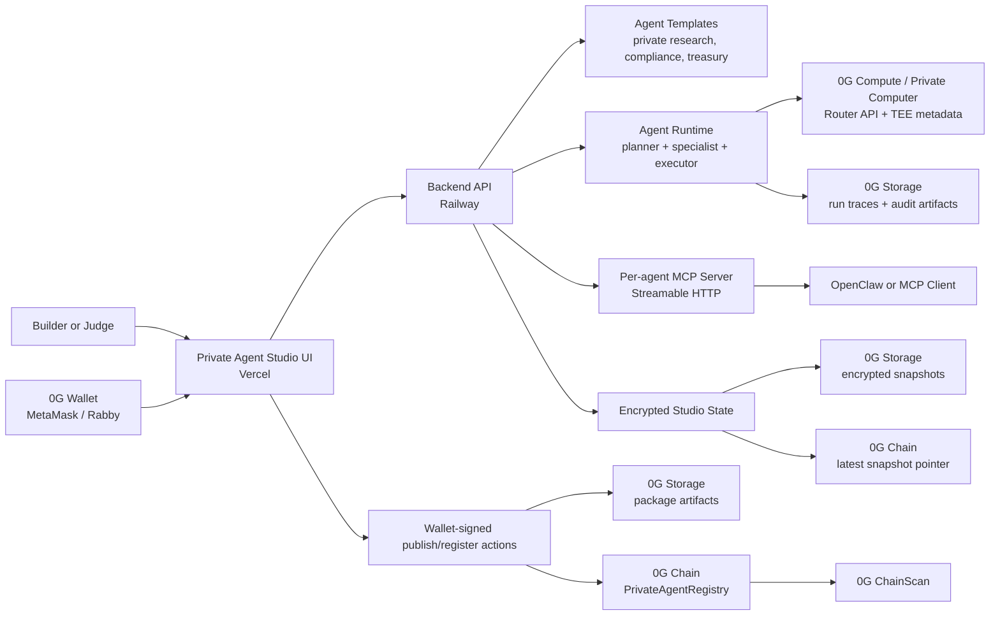

# Private Agent Studio

Private Agent Studio is a 0G-native workspace for creating private AI agents that can be owned, published, authorized, executed, and reused outside the builder.

The product turns an internal workflow into a verifiable agent package. A user chooses a template, shapes the agent, publishes the package to 0G Storage, registers the agent on 0G Chain, grants scoped usage rights, runs the workflow through 0G Compute, and exports the finished agent as a hosted API or MCP endpoint for runtimes such as OpenClaw.

## Live Deployment

| Surface | Link |
| --- | --- |
| Product app | https://private-agent-studio.vercel.app |
| Studio workspace | https://private-agent-studio.vercel.app/studio |
| Backend API | https://private-agent-studio-api-production.up.railway.app |
| 0G mainnet registry | `0xd06ea0b9AD8935df0e823555F0433604B880711D` |
| Registry explorer | https://chainscan.0g.ai/address/0xd06ea0b9AD8935df0e823555F0433604B880711D |
| Contract deployment tx | https://chainscan.0g.ai/tx/0xb0aefbd872d057f80c09c4d80b7e47ab96211b2c51f4c015d1d232d5c7464e62 |

Production is configured for 0G mainnet (`chainId=16661`) and 0G Router / Private Computer using `0GM-1.0-35B-A3B`.

## Product Flow

| Stage | What Happens | 0G Proof |
| --- | --- | --- |
| Build | User creates a private agent package from a guided template. | Draft package hash is prepared locally. |
| Publish | Package is uploaded as a durable artifact. | 0G Storage root is produced. |
| Register | Owner anchors package ownership and hashes. | 0G Chain registry record is written. |
| Authorize | Owner grants scoped usage to a wallet or runtime. | Usage grant is recorded on 0G Chain. |
| Run | Agent executes planner, specialist, and executor roles. | 0G Compute returns TEE metadata; trace is persisted to 0G Storage. |
| Handoff | Agent becomes a hosted API and MCP server. | MCP evidence tool exposes storage, registry, and runtime proof. |

## System Architecture



## 0G Component Usage

| 0G Component | Integration | Problem Solved |
| --- | --- | --- |
| 0G Storage | Backend uses `@0gfoundation/0g-storage-ts-sdk`; frontend wallet publish uses the 0G storage SDK path. | Stores published agent packages, encrypted state snapshots, run traces, and audit artifacts outside a single server. |
| 0G Chain | `PrivateAgentRegistry` contract on 0G mainnet. | Proves owner, package hash, storage root, policy hash, workflow hash, usage grants, and latest encrypted state pointer. |
| 0G Compute / Private Computer | Backend calls the 0G Router OpenAI-compatible API at `https://router-api.0g.ai/v1`. | Runs private multi-step agent workflows and returns TEE verification metadata for judge-visible runtime proof. |
| Agent ID-style registry | Each published agent has a stable Studio id and on-chain registry record. | Lets external clients reference a specific agent package instead of a generic prompt. |
| MCP | Backend uses `@modelcontextprotocol/sdk` for per-agent Streamable HTTP MCP endpoints. | Lets OpenClaw and other MCP clients call the published agent directly. |

The production backend also persists Studio state as encrypted 0G Storage snapshots and stores the latest snapshot pointer through the registry under `private-agent-studio-state`.

## Verified Mainnet Artifacts

| Artifact | Value |
| --- | --- |
| Registry contract | `0xd06ea0b9AD8935df0e823555F0433604B880711D` |
| Explorer | https://chainscan.0g.ai/address/0xd06ea0b9AD8935df0e823555F0433604B880711D |
| Network | 0G mainnet |
| Chain ID | `16661` |
| Storage indexer | `https://indexer-storage-turbo.0g.ai` |
| Compute API base | `https://router-api.0g.ai/v1` |
| Compute model | `0GM-1.0-35B-A3B` |

## MCP Handoff

Every published agent exposes an agent-specific MCP endpoint. For the live `Board Research Capsule` agent, the tools are:

```txt
board_research_capsule.run
board_research_capsule.summarize
board_research_capsule.evidence
```

The MCP evidence tool returns the published status, storage root, registry address, registration transaction, and runtime resources. This allows an MCP client to verify the same lifecycle that the browser UI shows.

Example endpoint pattern:

```txt
https://private-agent-studio-api-production.up.railway.app/api/agents/<agent_id>/mcp
```

## Repository Map

| Path | Purpose |
| --- | --- |
| [`frontend/`](frontend) | React Studio UI, lifecycle workspace, wallet interactions, and handoff screen. |
| [`backend/`](backend) | API server, 0G adapters, encrypted state persistence, runtime orchestration, and MCP endpoints. |
| [`contracts/`](contracts) | `PrivateAgentRegistry` contract used for ownership, storage roots, usage grants, and state pointers. |
| [`ARCHITECTURE.md`](ARCHITECTURE.md) | Deeper technical topology, trust boundaries, and lifecycle sequence. |

## Local Reproduction

The app can be reviewed from the live deployment without local secrets. Local reproduction is split into frontend-only review and full 0G write mode.

### 1. Clone and install

```bash
git clone https://github.com/N-45div/Private-Agent-Studio.git
cd Private-Agent-Studio
```

### 2. Run the backend

```bash
cd backend
npm install
cp ../.env.example .env
npm start
```

The backend starts on `http://127.0.0.1:4000` by default.

For read-only/local review, leave sensitive values empty or placeholder. For full mainnet reproduction, configure:

```txt
ZEROG_NETWORK=mainnet
ZEROG_RPC_URL=https://evmrpc.0g.ai
ZEROG_CHAIN_ID=16661
ZEROG_STORAGE_INDEXER_RPC=https://indexer-storage-turbo.0g.ai
PRIVATE_AGENT_REGISTRY_ADDRESS=0xd06ea0b9AD8935df0e823555F0433604B880711D
PRIVATE_KEY=<reviewer-funded-0g-wallet-private-key>
ZEROG_COMPUTE_API_KEY=<0g-private-computer-api-key>
ZEROG_COMPUTE_API_BASE=https://router-api.0g.ai/v1
ZEROG_COMPUTE_MODEL=0GM-1.0-35B-A3B
ZEROG_COMPUTE_REQUIRE_TEE=true
```

### 3. Run the frontend

```bash
cd frontend
npm install
cp .env.example .env
npm run dev
```

For local backend testing, set:

```txt
VITE_API_BASE_URL=http://127.0.0.1:4000
```

For production backend testing, keep:

```txt
VITE_API_BASE_URL=https://private-agent-studio-api-production.up.railway.app
```

### 4. Run tests

```bash
cd backend
npm test

cd ../frontend
npm run build
```

## Test Wallet and Faucet Notes

The submitted deployment runs on 0G mainnet. No private key or shared funded account is committed to the repository.

Judges can verify the product without funding a wallet by opening the live app, inspecting the registry contract, and using the hosted backend/MCP surfaces. To reproduce wallet-signed publish, registration, or authorization flows, use a reviewer-controlled wallet funded with 0G mainnet gas and connect it through MetaMask or Rabby.

For testnet experimentation, switch the environment to Galileo-compatible values:

```txt
ZEROG_NETWORK=testnet
ZEROG_CHAIN_ID=16602
ZEROG_RPC_URL=https://evmrpc-testnet.0g.ai
ZEROG_STORAGE_INDEXER_RPC=https://indexer-storage-testnet-turbo.0g.ai
```

Then fund the reviewer wallet from the official 0G faucet before attempting testnet transactions.

## Judge Review Path

1. Open https://private-agent-studio.vercel.app/studio.
2. Connect a 0G wallet or inspect the already published agent.
3. Choose an agent template and review the Build phase.
4. Publish the package to 0G Storage or inspect an existing storage root.
5. Register or inspect the agent on the 0G mainnet registry.
6. Authorize usage for a wallet/runtime.
7. Run the workflow through 0G Compute.
8. Open Handoff and copy the MCP endpoint, evidence, or hosted API payload.

## Security Notes

- Secrets are not committed.
- Production secrets are managed by the deployment platform.
- Backend-managed 0G Storage writes use a server-side signer only for platform-managed persistence.
- Owner-facing lifecycle actions remain wallet-confirmed in the Studio.
- Runtime trace storage is non-blocking and retries in the background so MCP clients do not time out while 0G Storage finality catches up.
